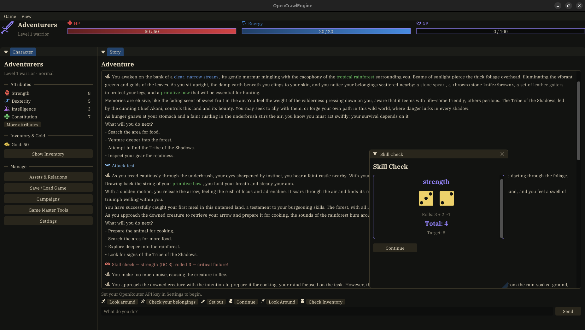

# OpenCrawlEngine

[](LICENSE)     



OpenCrawlEngine is a local, single-player role-playing game engine driven by a
language-model game master. It runs on your machine, talks to an OpenAI-compatible
endpoint that you supply a key for, stores characters and campaigns in a local
SQLite database, and renders a desktop interface built with Dear ImGui. There is
no server, account system, or telemetry.

## Features

- A language-model game master that narrates and drives the world through
  structured tool calls.
- Character creation with six classes, attributes, and a background, in a world
  you describe.
- A deterministic rules engine: attributes, items and equipment, turn-based
  combat, skill checks, leveling, businesses, factions, and world state.
- Multiple campaigns saved locally in SQLite, resuming where you left off.
- A Dear ImGui desktop interface. Choose your model and endpoint in settings.
- Works with any OpenAI-compatible endpoint, such as OpenRouter.

## Install

### AppImage (most Linux distributions)

Download `OpenCrawlEngine-x86_64.AppImage` from the
[releases page](https://github.com/savannah-i-g/OpenCrawlEngine/releases), make it
executable, and run it:

```
chmod +x OpenCrawlEngine-x86_64.AppImage
./OpenCrawlEngine-x86_64.AppImage
```

### Debian package (Ubuntu 24.04)

Download `opencrawlengine_0.1.0_amd64.deb` from the
[releases page](https://github.com/savannah-i-g/OpenCrawlEngine/releases) and
install it:

```
sudo apt install ./opencrawlengine_0.1.0_amd64.deb
```

This installs the `OpenCrawlEngine` command and a desktop entry.

## Build from source

Prerequisites (Ubuntu 24.04):

```
sudo apt install build-essential cmake ninja-build pkg-config \
    libglfw3-dev libgl1-mesa-dev libcurl4-openssl-dev libcjson-dev libsqlite3-dev
```

Build and run:

```
cmake -S . -B build -G Ninja -DCMAKE_BUILD_TYPE=Release
cmake --build build
./build/bin/OpenCrawlEngine
```

Dear ImGui and nanosvg are fetched at configure time. The remaining dependencies
come from the system. To build the distributable artifacts, run
`scripts/make-deb.sh` for the Debian package or `scripts/make-appimage.sh` for the
AppImage.

## Configuration

Provide an OpenAI-compatible API key in the application settings, or through the
environment before launching:

```
export OPENROUTER_API_KEY=sk-...
```

Saves and settings are stored under `~/.local/share/opencrawlengine/`.

## License

OpenCrawlEngine is released under the MIT License. See [LICENSE](LICENSE).
Third-party components and bundled icons are listed in [NOTICE.md](NOTICE.md).
